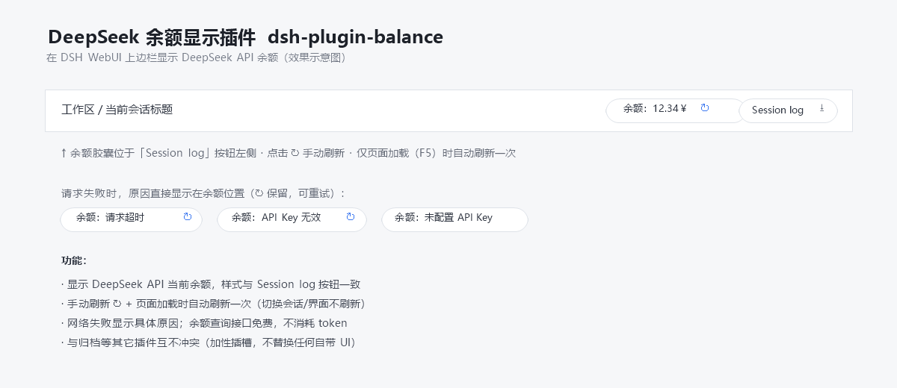

# dsh-plugin-balance

[English](README.md) | [简体中文](README.zh-CN.md)

一个轻量、**零构建**的 [DeepSeek Harness (DSH)](https://github.com/deepseek-ai/deepseek-harness) 插件：在 WebUI 上边栏显示你的 **DeepSeek API 余额**，紧挨系统自带的 **"Session log"** 按钮：

```
[余额：12.34￥ ↻]  [Session log]
```



## 功能

- 在上边栏右侧显示 DeepSeek API 当前余额，样式与系统自带的 "Session log" 按钮一致。
- **手动刷新**：点击 ↻ 按钮。
- **自动刷新**：仅页面加载（F5）后首次挂载时自动刷新一次；切换会话/界面不会自动刷新。
- **界面语言自适应**：标签（余额/Balance）、加载文案、以及所有错误提示都跟随 DSH WebUI 的语言（简体中文 / English）切换。
- **失败原因明确**：网络或凭据出错时，在余额位置以当前语言显示具体原因（如 `余额：请求超时`、`余额：API Key 无效`、`余额：未配置 API Key`）。
- **不消耗 API 额度**：`GET https://api.deepseek.com/user/balance` 是免费查询接口，刷新余额不会消耗 token（余额减少是聊天本身在用）。
- **与其他插件互不冲突**：注册在加性插槽 `conversation.session.header.utilities`（replaceRisk: none），不替换任何自带 UI。

API Key 通过 DSH 自身的凭据通道读取（`~/.dsh/.credentials.yaml` → `DEEPSEEK_API_KEY`），不离开宿主进程。

## 下载

方式一（Git clone）：

```bash
git clone https://github.com/anonRTtty/dsh-api-balance-displayer-plugin.git
```

方式二（ZIP）：打开[仓库页面](https://github.com/anonRTtty/dsh-api-balance-displayer-plugin) → **Code → Download ZIP**，解压后得到 `dsh-plugin-balance/` 目录。

## 安装

> **三选一，不要混用**（混用可能重复注册插件）。装完都要**重启 DSH**（或等 patch HMR 生效），然后硬刷新浏览器 `Ctrl+Shift+R`。

### 方式一：一键安装（Windows PowerShell，推荐）

无需 clone，直接运行（脚本会自动下载 release ZIP、复制到 profile 并启用）：

```powershell
irm https://raw.githubusercontent.com/anonRTtty/dsh-api-balance-displayer-plugin/main/scripts/install.ps1 | iex
```

或先 clone/解压后本地运行：

```powershell
cd dsh-plugin-balance
powershell -ExecutionPolicy Bypass -File .\scripts\install.ps1
```

非默认 profile：`powershell -ExecutionPolicy Bypass -File .\scripts\install.ps1 -ProfileName headless`

### 方式二：官方 CLI（`dsh plugin`）

```powershell
dsh plugin --profile web add github:anonRTtty/dsh-api-balance-displayer-plugin
```

本插件声明了 `dsh.bundle`，官方命令会把它加入 `dsh.profile.bundles` 并自动应用包内 `cordis.patch.yml`，**无需手动改任何配置文件**。

### 方式三：手动安装

1. 把整个 `dsh-plugin-balance/` 目录复制到：

   ```
   C:\Users\Administrator\.dsh\profiles\node_modules\dsh-plugin-balance\
   ```

2. 在 `C:\Users\Administrator\.dsh\profiles\web\cordis.patch.yml` 的 insert 列表中追加：

   ```yaml
   - insert:
       - id: dsh-plugin-balance
         name: dsh-plugin-balance
   ```

3. 重启 DSH。

## 卸载

一键卸载（Windows PowerShell）：

```powershell
irm https://raw.githubusercontent.com/anonRTtty/dsh-api-balance-displayer-plugin/main/scripts/uninstall.ps1 | iex
```

或本地运行：`powershell -ExecutionPolicy Bypass -File .\scripts\uninstall.ps1`

或手动：删除 `cordis.patch.yml` 中 `dsh-plugin-balance` 那两行，删除 `C:\Users\Administrator\.dsh\profiles\node_modules\dsh-plugin-balance\`，然后重启 DSH。

（若使用方式二安装，卸载时也请执行 `dsh plugin --profile web remove dsh-plugin-balance`。）

## 文件结构

```
dsh-plugin-balance/
├── package.json        # 包声明 + dsh.bundle（官方 CLI 自动激活）+ dsh.client 注入
├── cordis.patch.yml    # bundle patch（官方 CLI 安装时自动应用）
├── src/
│   ├── index.js        # Host 半部：/api/plugin.balance 路由（webServer 精确路由）
│   └── client.js       # 浏览器半部：双语余额胶囊（module-loader 格式）
├── scripts/
│   ├── install.ps1     # Windows 一键安装脚本
│   └── uninstall.ps1   # Windows 卸载脚本
├── screenshot.png      # 效果示意图
├── README.md           # 英文
├── README.zh-CN.md     # 简体中文
└── LICENSE
```

## 说明

- 余额接口：`GET https://api.deepseek.com/user/balance`（免费，不消耗 token）；凭据读取 `~/.dsh/.credentials.yaml` 中的 `DEEPSEEK_API_KEY`（与 DSH 内置模型路由同一凭据通道），Key 不离开宿主进程。
- 主机端通过 `webServer` 注册精确路由 `/api/plugin.balance`（与 dsh-plugin-session-delete 同款扩展点）；浏览器端通过同源 fetch 获取余额。
- License: MIT
